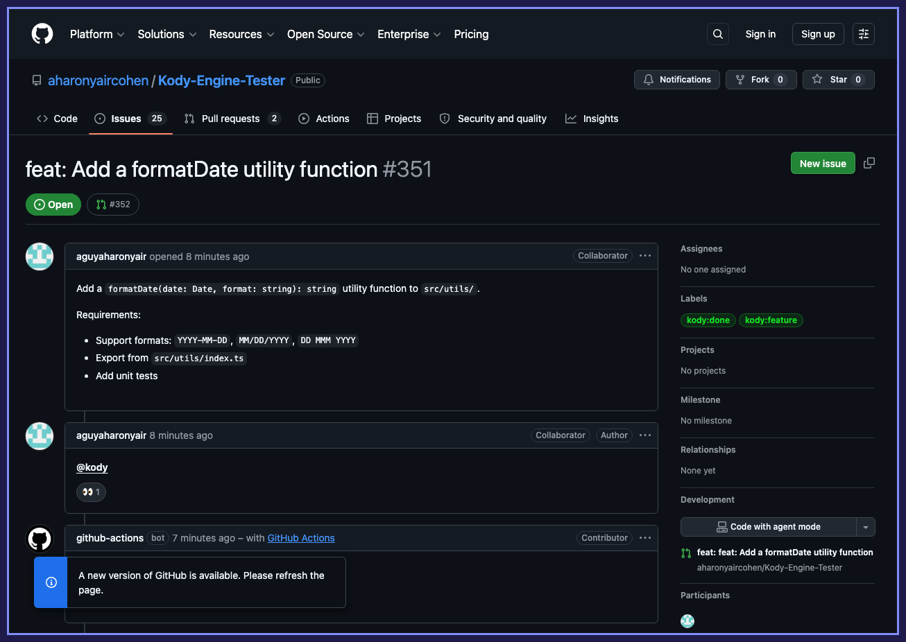
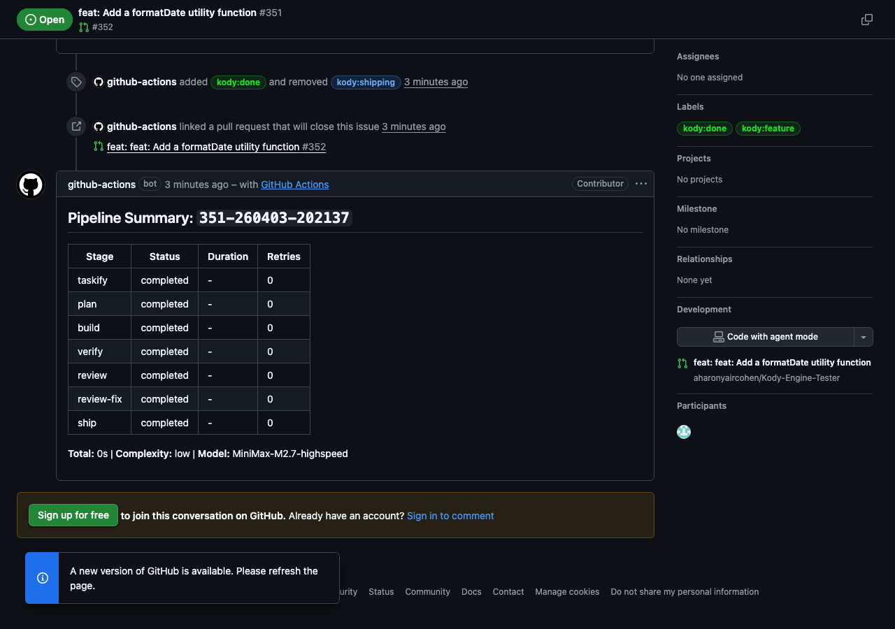
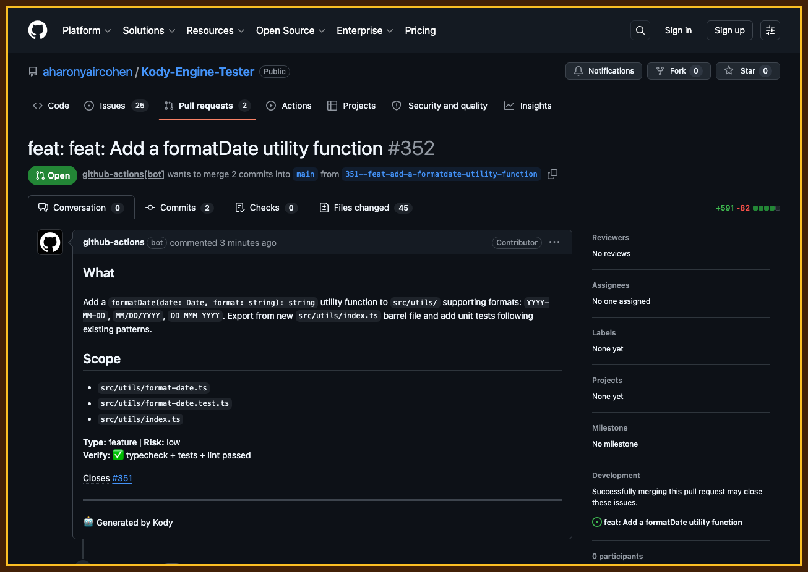
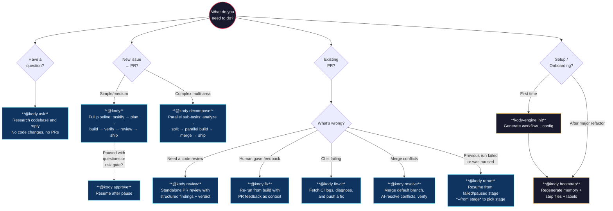
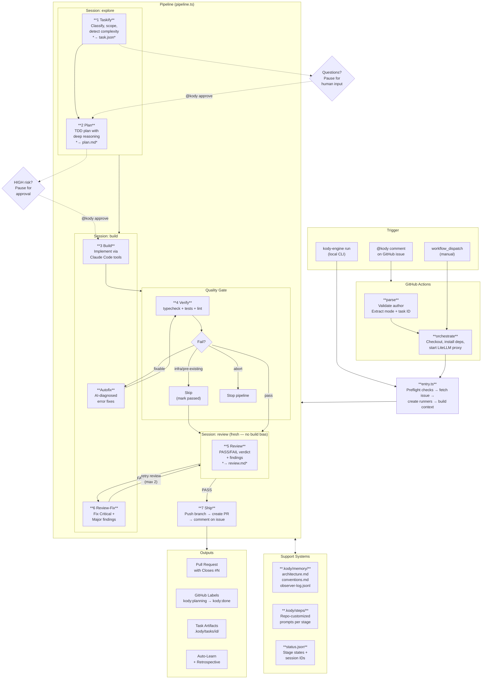

# Kody ADE — Autonomous Development Engine

[](https://www.npmjs.com/package/@kody-ade/engine)
[](LICENSE)

**The free, autonomous coding agent. Comment `@kody` on a GitHub issue. Get back a planned, built, verified, and reviewed PR.**

Kody wraps Claude Code with a 7-stage autonomous pipeline — research, plan, build, test, review, fix, ship — with quality gates between every stage. If verify catches a bug, it gets fixed before review ever sees it. No blind retries, no context drift, no babysitting.

- **Repo-aware prompts** — `bootstrap` analyzes your codebase and generates customized instructions for every stage, not generic "write clean code" prompts
- **Quality gates** — runs your repo's typecheck, tests, and lint between stages + AI code review in a fresh session
- **AI failure diagnosis** — classifies errors as fixable/infrastructure/pre-existing before retrying
- **Self-improving** — learns conventions, remembers architectural decisions, discovers existing patterns
- **Runs anywhere** — locally from your terminal or via GitHub Actions
- **Anthropic-compatible models** — Anthropic natively, or other providers (MiniMax, Gemini, etc.) via LiteLLM proxy

[Why Kody? →](docs/ABOUT.md) · [Full comparison →](docs/COMPARISON.md)

<p align="center">
  
</p>

## Quick Start

**Prerequisites:** A GitHub repo + an Anthropic API key (or [compatible provider](docs/LITELLM.md) key).

For local CLI usage, you also need: Node.js >= 22, [Claude Code CLI](https://docs.anthropic.com/en/docs/claude-code), [GitHub CLI](https://cli.github.com/), git.

### 1. Set up GitHub

Add your API key as a secret — via [GitHub web UI](https://docs.github.com/en/actions/security-for-github-actions/security-guides/using-secrets-in-github-actions#creating-secrets-for-a-repository) or CLI:

```bash
gh secret set ANTHROPIC_API_KEY --repo owner/repo
```

Then in GitHub: **Settings → Actions → General → "Allow GitHub Actions to create and approve pull requests"**

### 2. Initialize

Copy the [workflow template](templates/kody.yml) to `.github/workflows/kody.yml` and add a `kody.config.json` to your repo root. Or use the CLI to auto-generate both:

```bash
npm install -g @kody-ade/engine
cd your-project
kody-engine init
```

### 3. Bootstrap

Create a new GitHub issue (e.g., "Setup Kody") and comment:

```
@kody bootstrap
```

This analyzes your codebase with an LLM and generates:
- **Project memory** (`.kody/memory/` — architecture and conventions)
- **Customized step files** (`.kody/steps/` — repo-aware prompts for every stage)
- **Tools template** (`.kody/tools.yml` — configure external tools like Playwright, see [Tools](docs/TOOLS.md))
- **GitHub labels** for lifecycle tracking (14 labels)

### 4. Use

Comment on any GitHub issue:

```
@kody
```

Kody picks up the issue and works through the pipeline autonomously:

<div align="center">
  <picture>
    
  </picture>
  <br><sub>▲ Comment <code>@kody</code> on an issue — pipeline starts automatically</sub>
</div>

<br>

You'll see labels updating in real-time, progress comments at each stage, and a pipeline summary when done:

<div align="center">
  <picture>
    
  </picture>
  <br><sub>▲ Pipeline summary — all stages completed with duration and retries</sub>
</div>

<br>

The result is a PR with a rich description, passing quality checks, and `Closes #N`:

<div align="center">
  <picture>
    
  </picture>
  <br><sub>▲ PR created by Kody — description, scope, verify status, Closes #N</sub>
</div>

If the task is HIGH-risk, Kody pauses after planning and asks for approval before writing code.

### Switch to a different model (optional)

```json
// kody.config.json
{ "agent": { "provider": "minimax" } }
```

```
# .env
ANTHROPIC_COMPATIBLE_API_KEY=your-key-here
```

Kody auto-starts the LiteLLM proxy. [Full LiteLLM guide →](docs/LITELLM.md)

## Which command should I use?



## Commands

| Command | What it does |
|---------|-------------|
| `@kody` | Run full pipeline on an issue |
| `@kody decompose` | Parallel sub-tasks for complex issues — analyze, split, build in parallel, merge, verify, review, ship ([details](docs/DECOMPOSE.md)) |
| `@kody compose` | Retry merge + verify + review + ship after a decompose build succeeded |
| `@kody review` | Review any PR — structured findings + GitHub approve/request-changes (falls back to comment if self-review blocked) |
| `@kody fix` | Re-run from build with human PR feedback + Kody's review as context |
| `@kody fix-ci` | Fix failing CI checks (auto-triggered with loop guard) |
| `@kody resolve` | Merge default branch into PR, AI-resolve conflicts, verify, push |
| `@kody rerun` | Resume from failed or paused stage |
| `@kody rerun --from <stage>` | Resume from a specific stage |
| `@kody ask` | Research the codebase and reply with an answer — no code changes, no PRs |
| `@kody approve` | Resume after questions or risk gate |
| `@kody bootstrap` | Regenerate project memory and step files |

```bash
kody-engine init [--force]          # Setup repo: workflow + config + watch
kody-engine bootstrap [--force] [--provider=claude --model=opus-4-6]  # Generate memory + step files + labels + digest issue
kody-engine run --issue-number 42 --local --cwd ./project
kody-engine run --task "Add retry utility" --local
kody-engine review --pr-number 42   # Standalone PR review
kody-engine fix --issue-number 42 --feedback "Use middleware pattern"
kody-engine fix-ci --pr-number 42
kody-engine resolve --pr-number 42   # Merge + resolve conflicts
kody-engine --ask "How does auth work?" # Ask a question about the codebase
kody-engine decompose --issue-number 42  # Parallel sub-tasks for complex issues
kody-engine compose --task-id <id>  # Retry compose after decompose
kody-engine rerun --issue-number 42 --from verify
kody-engine watch [--dry-run]       # Run health monitoring locally
```

[Full CLI reference with all flags and options →](docs/CLI.md)

## Key Features

- **Repo-Aware Step Files** — auto-generated prompts with your repo's patterns, gaps, and acceptance criteria ([details](docs/FEATURES.md#repo-aware-step-files-kodysteps))
- **Standalone PR Review** — `@kody review` on any PR for structured code review with GitHub approve/request-changes ([details](docs/FEATURES.md#standalone-pr-review))
- **Shared Sessions** — stages share Claude Code sessions, no cold-start re-exploration ([details](docs/FEATURES.md#shared-sessions))
- **Risk Gate** — HIGH-risk tasks pause for human approval before building ([details](docs/FEATURES.md#risk-gate))
- **AI Failure Diagnosis** — classifies errors as fixable/infrastructure/pre-existing/abort before retry ([details](docs/FEATURES.md#ai-powered-failure-diagnosis))
- **Question Gates** — asks product/architecture questions when the task is unclear ([details](docs/FEATURES.md#question-gates))
- **Auto Fix-CI** — CI fails on a PR? Kody fetches logs, diagnoses, and pushes a fix ([details](docs/FEATURES.md#auto-fix-ci))
- **Parallel Decomposition** — complex tasks auto-split into independent sub-tasks that build in parallel, then merge and verify ([details](docs/DECOMPOSE.md))
- **Pattern Discovery** — searches for existing patterns before proposing new ones ([details](docs/FEATURES.md#pattern-discovery))
- **Decision Memory** — architectural decisions extracted from reviews persist across tasks ([details](docs/FEATURES.md#decision-memory))
- **Auto-Learning** — extracts coding conventions from each successful run ([details](docs/FEATURES.md#auto-learning-memory))
- **Retrospective** — analyzes each run, identifies patterns, suggests improvements ([details](docs/FEATURES.md#retrospective-system))
- **Kody Watch** — periodic health monitoring: pipeline health, security scanning, config validation every 30 min ([setup guide](docs/WATCH.md))
- **Anthropic-Compatible Models** — route through LiteLLM to use other providers like MiniMax, Gemini, etc. ([setup guide](docs/LITELLM.md) · [model test results](docs/model-compatibility.md))

## Architecture

<details>
<summary>System overview (click to expand)</summary>



</details>

[Full architecture docs →](docs/ARCHITECTURE.md)

## Documentation

**Understand Kody:** [About](docs/ABOUT.md) · [Architecture](docs/ARCHITECTURE.md) · [Tech Stack](docs/TECH-STACK.md) · [Features](docs/FEATURES.md) · [Pipeline](docs/PIPELINE.md) · [Comparison](docs/COMPARISON.md)

**Set up & use:** [CLI](docs/CLI.md) · [Configuration](docs/CONFIGURATION.md) · [Bootstrap](docs/BOOTSTRAP.md) · [Decompose](docs/DECOMPOSE.md) · [Tools](docs/TOOLS.md) · [Watch](docs/WATCH.md) · [LiteLLM](docs/LITELLM.md)

**Reference:** [FAQ](docs/FAQ.md) · [Model Compatibility](docs/model-compatibility.md)

## Generating Demo GIFs

Demo GIFs can be generated using [VHS](https://github.com/charmbracelet/vhs). Tape files are in `assets/tapes/`:

```bash
brew install vhs            # install VHS
vhs assets/tapes/init.tape  # → assets/demo-init.gif
vhs assets/tapes/run-local.tape  # → assets/demo-run.gif (runs a real pipeline)
```

## License

MIT
