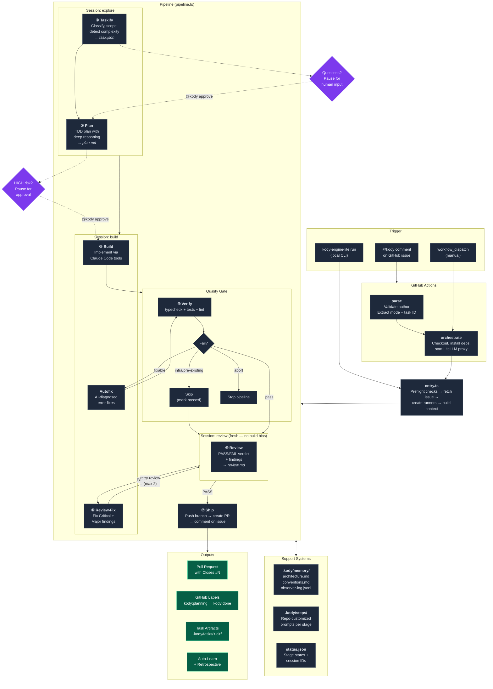

```mermaid
flowchart TB
    %% ── Trigger Layer ──
    subgraph trigger ["Trigger"]
        direction LR
        Comment["@kody comment<br/>on GitHub issue"]
        Dispatch["workflow_dispatch<br/>(manual)"]
        CLI["kody-engine-lite run<br/>(local CLI)"]
    end

    %% ── CI Layer ──
    subgraph ci ["GitHub Actions"]
        direction LR
        Parse["<strong>parse</strong><br/>Validate author<br/>Extract mode + task ID"]
        Orchestrate["<strong>orchestrate</strong><br/>Checkout, install deps,<br/>start LiteLLM proxy"]
        Parse --> Orchestrate
    end

    %% ── Engine Entry ──
    Entry["<strong>entry.ts</strong><br/>Preflight checks → fetch issue →<br/>create runners → build context"]

    %% ── Pipeline ──
    subgraph pipeline ["Pipeline  (pipeline.ts)"]
        direction TB

        subgraph explore ["Session: explore"]
            direction LR
            Taskify["<strong>① Taskify</strong><br/>Classify, scope,<br/>detect complexity<br/><em>→ task.json</em>"]
            Plan["<strong>② Plan</strong><br/>TDD plan with<br/>deep reasoning<br/><em>→ plan.md</em>"]
            Taskify --> Plan
        end

        subgraph build_session ["Session: build"]
            direction LR
            Build["<strong>③ Build</strong><br/>Implement via<br/>Claude Code tools"]
            Autofix["<strong>Autofix</strong><br/>AI-diagnosed<br/>error fixes"]
            ReviewFix["<strong>⑥ Review-Fix</strong><br/>Fix Critical +<br/>Major findings"]
        end

        subgraph verify_loop ["Quality Gate"]
            Verify["<strong>④ Verify</strong><br/>typecheck + tests + lint"]
            Diagnose{"Fail?"}
            Verify --> Diagnose
            Diagnose -->|"fixable"| Autofix
            Autofix --> Verify
            Diagnose -->|"infra/pre-existing"| Skip["Skip<br/>(mark passed)"]
            Diagnose -->|"abort"| Abort["Stop pipeline"]
        end

        subgraph review_session ["Session: review  (fresh — no build bias)"]
            Review["<strong>⑤ Review</strong><br/>PASS/FAIL verdict<br/>+ findings<br/><em>→ review.md</em>"]
        end

        Ship["<strong>⑦ Ship</strong><br/>Push branch → create PR<br/>→ comment on issue"]

        explore --> build_session
        Build --> verify_loop
        Skip --> review_session
        Diagnose -->|"pass"| review_session
        review_session -->|"FAIL"| ReviewFix
        ReviewFix -->|"retry review<br/>(max 2)"| review_session
        review_session -->|"PASS"| Ship
    end

    %% ── Support Systems ──
    subgraph support ["Support Systems"]
        direction LR
        Memory["<strong>.kody/memory/</strong><br/>architecture.md<br/>conventions.md<br/>observer-log.jsonl"]
        Steps["<strong>.kody/steps/</strong><br/>Repo-customized<br/>prompts per stage"]
        State["<strong>status.json</strong><br/>Stage states +<br/>session IDs"]
    end

    %% ── Outputs ──
    subgraph outputs ["Outputs"]
        direction LR
        PR["Pull Request<br/>with Closes #N"]
        Labels["GitHub Labels<br/>kody:planning → kody:done"]
        Artifacts["Task Artifacts<br/>.kody/tasks/&lt;id&gt;/"]
        Learn["Auto-Learn<br/>+ Retrospective"]
    end

    %% ── Gates ──
    QuestionGate{"Questions?<br/>Pause for<br/>human input"}
    RiskGate{"HIGH risk?<br/>Pause for<br/>approval"}

    %% ── Connections ──
    Comment --> ci
    Dispatch --> Orchestrate
    CLI --> Entry
    Orchestrate --> Entry
    Entry --> pipeline

    Taskify -.-> QuestionGate
    Plan -.-> RiskGate
    QuestionGate -.->|"@kody approve"| Plan
    RiskGate -.->|"@kody approve"| Build

    pipeline <-..-> support
    Ship --> outputs

    %% ── Styles ──
    classDef default fill:#1e293b,stroke:#475569,color:#e2e8f0
    classDef gate fill:#7c3aed,stroke:#a78bfa,color:#fff
    classDef output fill:#065f46,stroke:#34d399,color:#fff

    class QuestionGate,RiskGate gate
    class PR,Labels,Artifacts,Learn output
```
