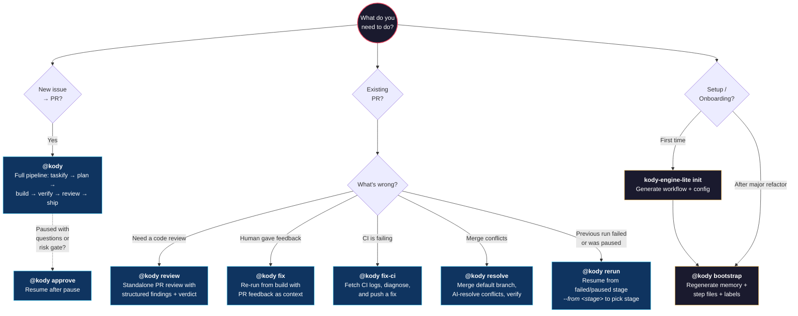

```mermaid
flowchart TD
    Start(("What do you<br/>need to do?")):::start

    Start --> NewIssue{"New issue<br/>→ PR?"}
    Start --> ExistingPR{"Existing<br/>PR?"}
    Start --> Setup{"Setup /<br/>Onboarding?"}

    %% New issue path
    NewIssue -->|Yes| Kody["<strong>@kody</strong><br/>Full pipeline: taskify → plan →<br/>build → verify → review → ship"]:::cmd

    %% Existing PR paths
    ExistingPR --> PRWhat{"What's wrong?"}

    PRWhat -->|"Need a code review"| Review["<strong>@kody review</strong><br/>Standalone PR review with<br/>structured findings + verdict"]:::cmd

    PRWhat -->|"Human gave feedback"| Fix["<strong>@kody fix</strong><br/>Re-run from build with<br/>PR feedback as context"]:::cmd

    PRWhat -->|"CI is failing"| FixCI["<strong>@kody fix-ci</strong><br/>Fetch CI logs, diagnose,<br/>and push a fix"]:::cmd

    PRWhat -->|"Merge conflicts"| Resolve["<strong>@kody resolve</strong><br/>Merge default branch,<br/>AI-resolve conflicts, verify"]:::cmd

    PRWhat -->|"Previous run failed<br/>or was paused"| Rerun["<strong>@kody rerun</strong><br/>Resume from failed/paused stage<br/><em>--from &lt;stage&gt;</em> to pick stage"]:::cmd

    %% Setup paths
    Setup -->|"First time"| Init["<strong>kody-engine-lite init</strong><br/>Generate workflow + config"]:::setup
    Init --> Bootstrap
    Setup -->|"After major refactor"| Bootstrap["<strong>@kody bootstrap</strong><br/>Regenerate memory +<br/>step files + labels"]:::setup

    %% Was pipeline paused by questions or risk gate?
    Kody -.->|"Paused with<br/>questions or<br/>risk gate?"| Approve["<strong>@kody approve</strong><br/>Resume after pause"]:::cmd

    classDef start fill:#1a1a2e,stroke:#e94560,color:#fff,stroke-width:2px
    classDef cmd fill:#0f3460,stroke:#53d8fb,color:#fff,stroke-width:1px
    classDef setup fill:#1a1a2e,stroke:#e9b44c,color:#fff,stroke-width:1px
```
